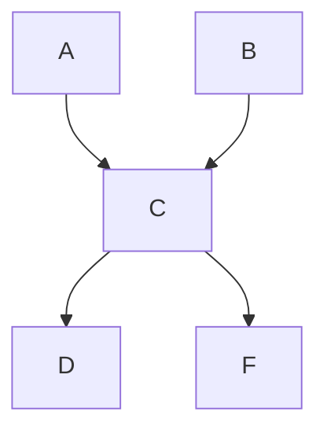
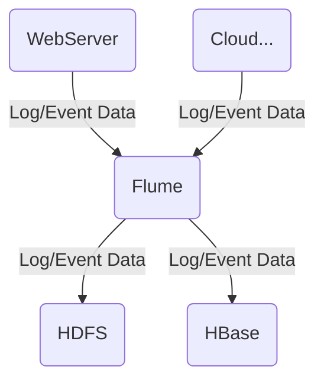

## try flow



```mermaid
graph TD;
A-->C;
B-->C;
C-->D;
C-->F;
```


```flow
st=>start: Start
e=>end
HBase=>end
op=>operation: WebServer
c=>operation: Cloud
cond=>condition: Flume

st->op->cond
st->c->cond
cond(yes)->e
cond(no)->HBase
```


```mermaid
graph TB
F(Flume)
A(WebServer)-->|Log/Event Data|F
B(Cloud...)-->|Log/Event Data|F
F-->|Log/Event Data|H(HDFS)
F-->|Log/Event Data|I(HBase)
```
